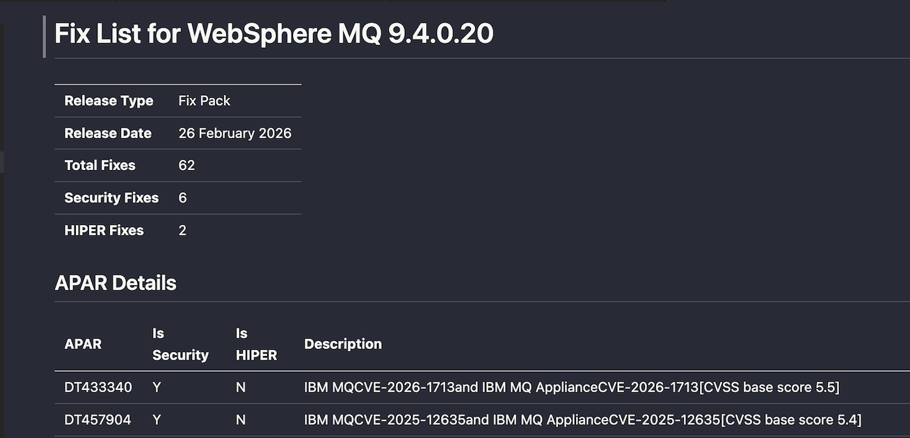

# WebSphere MQ Fix Pack Summary

This Python script retrieves IBM's support pages to gather information about APARs (Authorized Program Analysis Reports) included in a specific IBM WebSphere MQ 9.3 LTS and 9.4 LTS. It consolidates fix pack information into CSV and Markdown files.

## Features

*   **Consolidated Data:** Gathers APARs for both WebSphere Application Server and IBM HTTP Server.
*   **Latest Fix Pack:** if input with 9.4.0.0 or 9.3.0.0
*   **Fix Pack Specific:** Fetches the list of APARs associated with a user-provided fix pack version (e.g., `9.4.0.20`).
<!-- *   **Detailed Metadata:** For non-security APARs, it visits the individual APAR page to scrape metadata such as Component, Status, Submitted/Closed dates, and more. -->
*   **Dual Export:** Saves all collected information into clean, easy-to-use CSV and Markdown files.

## Prerequisites

*   Python 3
*   Required Python libraries: `requests` and `beautifulsoup4`.

You can install the dependencies using pip:
```bash
pip install requests beautifulsoup4
```

## Usage

1.  Run the script from your terminal:
    ```bash
    python mq_fixpack.py
    ```
2.  The script will prompt you to enter the desired fix pack version (in `V.R.M.F` format). The program will then process both WAS and IHS sources and display its progress.

### Example Execution

```
--- IBM Consolidated APARs for WebSphere MQ 9.4 LTS and 9.3 LTS ---
Enter Fix Pack Version (e.g., 9.4.0.20 or 9.4.0.0/9.3.0.0 for latest): 9.4.0.0
Complete retrieving data.
Latest version found: 9.4.0.20

[1/62] DT433340

[2/62] DT457904

[3/62] DT459614

[4/62] DT460995

[5/62] DT461364
...

Successfully generated: wmq_fixpack_94020_20260226.csv and wmq_fixpack_94020_20260226.md

=============================================
WebSphere MQ FIX PACK 9.4.0.20
=============================================
Fix Type: Fix Pack
Release Date: 26 February 2026
Total Fixes: 62
Security Fixes: 6
HIPER Fixes: 2

---------------------------------------------
CSV Report: wmq_fixpack_94020_20260226.csv
Markdown Report: wmq_fixpack_94020_20260226.md
=============================================
```

## Output Format

The script generates a CSV file named `wmq_fipack_<version>_YYYYMMDD.csv`  and `wmq_fipack_<version>_YYYYMMDD.md` (e.g., `was_fix_pack_90526_20251202.csv`).

The columns include: `APAR`,`Is Security`,`Is HIPER`,`Description`.

### Example CSV Output ([wmq_fixpack_93037_20260226.csv](wmq_fixpack_94020_20260226.csv))

```csv
APAR,Is Security,Is HIPER,Description
DT433340,Y,N,IBM MQCVE-2026-1713and IBM MQ ApplianceCVE-2026-1713[CVSS base score 5.5]
DT457904,Y,N,IBM MQCVE-2025-12635and IBM MQ ApplianceCVE-2025-12635[CVSS base score 5.4]
DT459614,Y,N,"IBM MQ ApplianceCVE-2025-39971, CVE-2025-39955[CVSS base score 7.6]"
```
### Example MD Output ([wmq_fixpack_94020_20260226.md](wmq_fixpack_94020_20260226.md))



<!-- ## Important Note on Security APARs

For APARs marked as security-related (`isSecurity` = `Y`), the script **does not** scrape the individual APAR detail page. This is an intentional design choice due to different APAR detailed inforamtion. You can find more information from CVE and CVSS in column title.  -->
